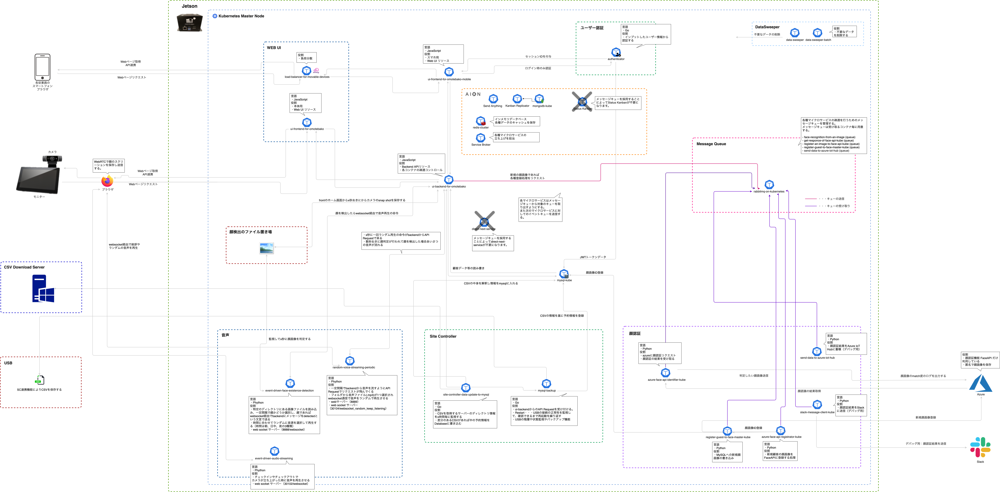

# microservice-oriented-architecture  
microservice-oriented-architecture は、マイクロサービスアーキテクチャの概要と、LatonaおよびAIONにおけるマイクロサービスアーキテクチャのコンセプトです。

## マイクロサービスアーキテクチャの概要  
マイクロサービスアーキテクチャは、サービスを構成する各要素を、独立した小さなコンポーネントとして実装したアーキテクチャです。    
マイクロサービスアーキテクチャでは、個々のマイクロサービスは他のマイクロサービスに依存せず起動でき、独立してデプロイやアップデートが可能なため、スケーラビリティや可搬性に優れています。   

## AIONにおけるマイクロサービスアーキテクチャ  
AIONにおけるマイクロサービスアーキテクチャは、Kubernetes / Docker / Aion-Core をベースとした包括的なマイクロサービス環境だけでなく、RabbitMQ、Redis、Envoy、ReactJS、MongoDB、MySQL 等の周辺リソースの技術とフレームワークをフル活用した、360°マイクロサービスアーキテクチャの環境を採用しています。   
これにより、大きな単位のサービス管理だけでなく、真に細かく刻まれたレベルにおいてのマイクロサービスの開発実行環境を実現することが可能です。  
また、これらのマイクロサービス環境は、他の全てのコンポーネントやマイクロサービスと、疎結合できるように設計されています。  

## AIONにおけるマイクロサービスアーキテクチャコンセプト   
    

## AIONにおけるマイクロサービスアーキテクチャの例（エッジアプリケーション OMOTE-Bako のアーキテクチャ） 
以下のアーキテクチャ図において、それぞれのレポジトリ名(例：service-broker, rabbitmq-on-kubernetes, redis-cluster, mysql-kube, data-sweeper-kube, ui-frontend-for-omotebako, ui-backend-for-omotebako, load-balancer-for-movable-devices, azure-face-api-identifier-kube）で表現された単位が、マイクロサービスの単位です。  
このように、各マイクロサービスはコンテナ化され独立して動作しており、コンテナオーケストレーションシステムのKubernetesによって制御・監視されています。  
なお、各マイクロサービス間は疎結合しており、メッセージングアーキテクチャのコアであるRabbitMQ等によってマイクロサービス間のやりとりが行われています。
   
