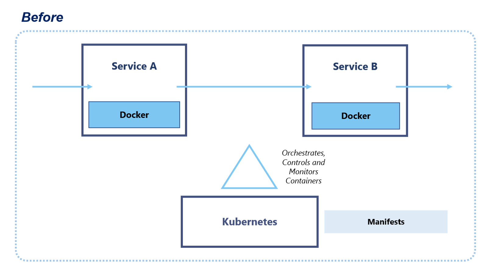
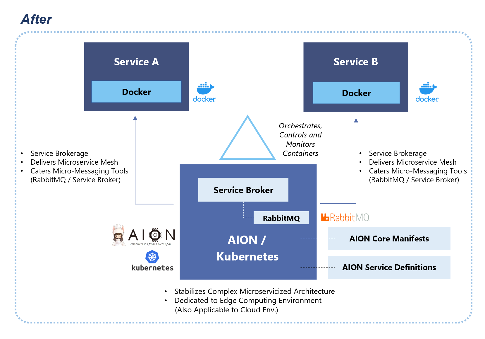
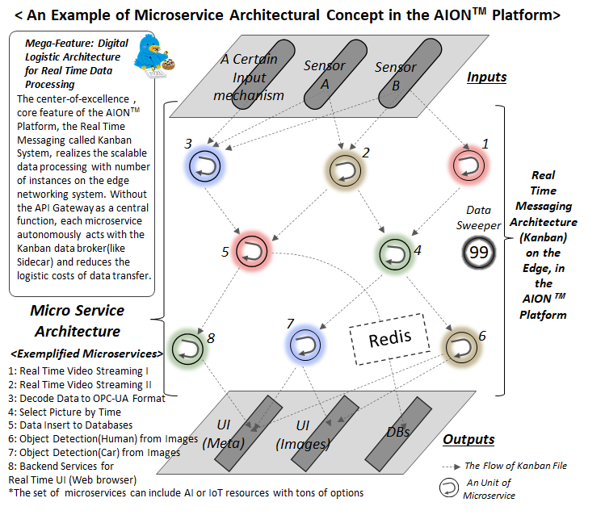

# microservice-oriented-architecture  
microservice-oriented-architecture は、マイクロサービスアーキテクチャの概要と、LatonaおよびAIONにおけるマイクロサービスアーキテクチャのコンセプトです。

## マイクロサービスアーキテクチャの概要  
マイクロサービスアーキテクチャは、サービスを構成する各要素を、独立した小さなコンポーネントとして実装したアーキテクチャです。    
マイクロサービスアーキテクチャでは、個々のマイクロサービスは他のマイクロサービスに依存せず起動でき、独立してデプロイやアップデートが可能なため、スケーラビリティや可搬性に優れています。   

## AIONにおけるマイクロサービスアーキテクチャ  
AIONにおけるマイクロサービスアーキテクチャは、Kubernetes / Docker / Aion-Core をベースとした包括的なマイクロサービス環境だけでなく、RabbitMQ、Fluentd、Redis、Envoy、ReactJS、MongoDB、MySQL 等の周辺リソースの技術とフレームワークをフル活用した、360°マイクロサービスアーキテクチャの環境を採用しています。   
これにより、大きな単位のサービス管理だけでなく、真に細かく刻まれたレベルにおいてのマイクロサービスの開発実行環境を実現することが可能です。  
また、これらのマイクロサービス環境は、他の全てのコンポーネントやマイクロサービスと、疎結合できるように設計されています。  

## Kubernetes の Pods を マイクロサービスメッシュにした 新生アーキテクチャの概念 
AIONでは、Kubernetes Pods と Aion-Core の Service Broker をコアとして、洗練された新生のマイクロサービスメッシュアーキテクチャが実現されています。    
[aion-core-manifests](https://github.com/latonaio/aion-core-manifests)や、[aion-service-definitions](https://github.com/latonaio/aion-service-definitions)等により、洗練されたフォーマット定義で標準化されたマイクロサービスの定義ファイルが設定され、複雑なアプリケーション環境においても、ソースコードの開発、デプロイ、メンテナンスを簡単に行うことができます。

### 今までの Kubernetes による マイクロサービスメッシュアーキテクチャ  
   
### AION と Kubernetes を組み合わせた 新しいマイクロサービスメッシュアーキテクチャ  
Kubernetes に加えてAION のアーキテクチャを実装することにより、次の機能・環境が付加されます。 

* Service Brokerage （主に Service Broker による機能）

* Microservice Mesh （Kubernetesだけでは制御/管理/維持が非効率な Micoservice Mesh の機能）

* Micro-Messaging Tools (Service Broker と RabbitMQ の組み合わせによる Microservice Level の メッセージングツール）

* Stabilization of Complex Microservicized Architecture (複雑なマイクロサービスアーキテクチャでも安定化する機能）

* Dedicated to Edge Computing Environment (エッジコンピューティング環境に最適化 ※クラウド環境でも適用可能）

  

## AIONにおけるマイクロサービスアーキテクチャコンセプト   
    

## AIONにおけるマイクロサービスアーキテクチャの例（エッジアプリケーション OMOTE-Bako のアーキテクチャ） 
以下のアーキテクチャ図において、それぞれのレポジトリ名(例：[service-broker](https://github.com/latonaio/aion-core/tree/main/cmd/service-broker), [rabbitmq-on-kubernetes](https://github.com/latonaio/rabbitmq-on-kubernetes), [redis-cluster-kube](https://github.com/latonaio/redis-cluster-kube), [mysql-kube](https://github.com/latonaio/mysql-kube), [data-sweeper-kube](https://github.com/latonaio/data-sweeper-kube), [ui-frontend-for-omotebako](https://github.com/latonaio/ui-frontend-for-omotebako), ui-backend-for-omotebako, [load-balancer-for-movable-devices](https://github.com/latonaio/load-balancer-for-movable-devices), [azure-face-api-identifier-kube](https://github.com/latonaio/azure-face-api-identifier-kube)), で表現された単位が、マイクロサービスの単位です。  
このように、各マイクロサービスはコンテナ化され独立して動作しており、コンテナオーケストレーションシステムのKubernetesによって制御・監視されています。  
なお、各マイクロサービス間は疎結合しており、メッセージングアーキテクチャのコアであるRabbitMQ等によってマイクロサービス間のやりとりが行われています。
   

## エッジコンピューティング環境における AION / Kubernetes 上の Pods 立ち上げ例（エッジアプリケーション OMOTE-Bako の場合） 
実際にエッジコンピューティング環境（NVIDIA Jetson Xavier or NX）において AION / Kubernetes上に各マイクロサービスのPodを立ち上げ運用すると、以下のようになります。
```
rabbitmq-on-kubernetes-7f9fbfc8d6-xl7qs                     1/1   Running  0   4d11h
aion-kanban-replicator-78867bdbfc-5pgr7          　　　      2/2   Running  0   4d11h
aion-statuskanban-7bb486b86f-2d8zl                          2/2   Running  0   4d11h
aion-servicebroker-75cf6cf747-dx7gl                         2/2   Running  0   4d11h
aion-sendanything-656676dd9-4cg9b                           2/2   Running  0   4d11h
fluentd-for-containers-mongodb-kube-2rj8b                   1/1   Running  0   4d11h
redis-cluster-7f5654dfd8-d6ng4                              1/1   Running  0   4d11h
mongodb-kube-67d94f5d9f-8rwxg                               1/1   Running  0   4d11h
mysql-kube-59c84c6655-n7xgr                                 1/1   Running  0   4d6h
data-sweeper-kube-84964d56d9-9mnrt                          1/1   Running  0   4d11h
data-sweeper-batch-kube-84665c4dcc-lslfs                    1/1   Running  0   4d11h
azure-face-api-identifier-kube-001-7f78b944c6-bq598         2/2   Running  0   4d5h
azure-face-api-registrator-kube-001-5f7fc54df5-26qlt        2/2   Running  0   4d11h
register-face-to-guest-table-kube-001-787bcc596b-f4ddr      2/2   Running  0   4d11h
send-data-to-azure-iot-hub-694654499b-lnqtz                 1/1   Running  0   4d11h
random-voice-streaming-periodic-8465844c97-6l77w            1/1   Running  0   4d11h
site-controller-data-update-to-mysql-001-7f5c9b6478-trjxt   2/2   Running  0   4d11h
ui-backend-for-omotebako-d6455cbfb-bjrpj                    1/1   Running  0   4d11h
ui-frontend-for-omotebako-85d5c5765f-mfxwb                  1/1   Running  0   4d11h
ui-frontend-for-omotebako-mobile-8d548c55d-vb4sb            2/2   Running  0   4d11h
load-balancer-for-movable-devices-001-85f894fc7c-64hdf      2/2   Running  0   4d11h
mongo-express-kube-5f98f854dc-tfcd2                         1/1   Running  2   4d11h
```